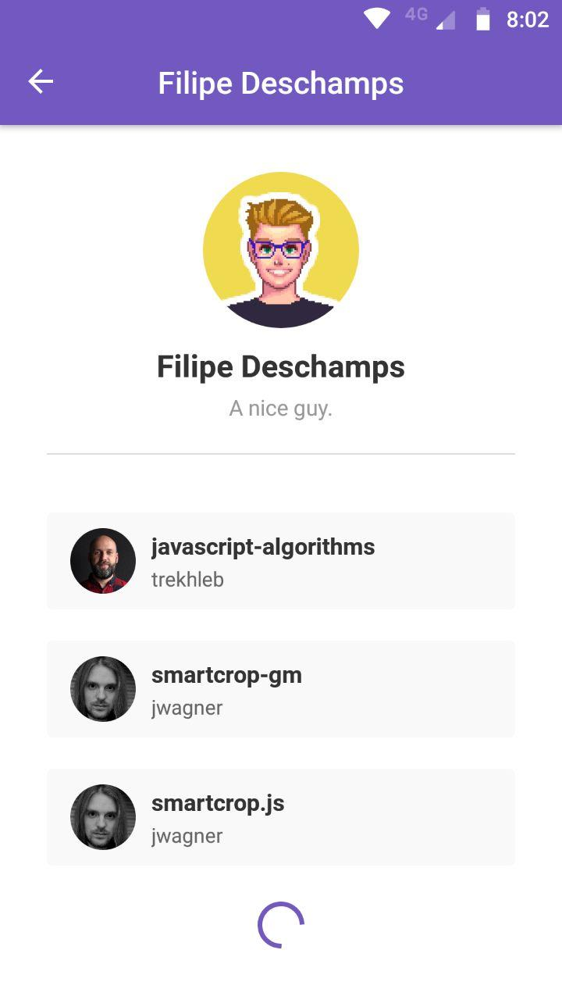
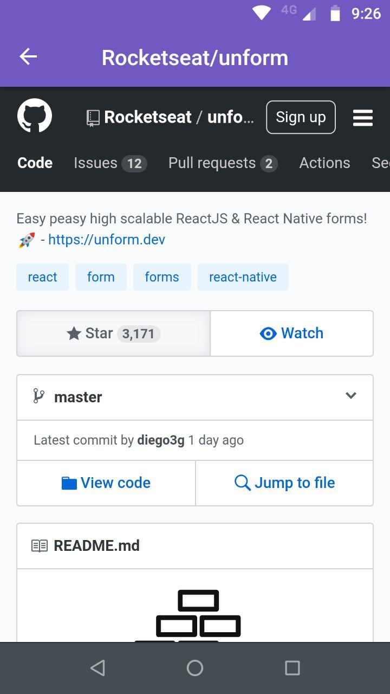

# Usuários do GitHub

A aplicação lista usuários do GitHub cadastrados na aplicação. Para cadastrar um usuário basta informar o login do usuário no input na página inicial e clicar em '+'.

Clicando em <strong>VER PERFIL</strong> é possível ver a listagem dos repositórios favoritos do usuário.

# Imagens do App
<p align="center">
  
  
  
  
</p>
<p align="center">
  
  
  
  
</p>

## Instalação

Como a aplicação foi construída para fins didáticos o passo a passo abaixo provê a instalação em modo de desenvolvimento.

Conecte o dispositivo Android via USB em modo de Debug. Após clonar o repositório, dentro da pasta criada, execute o comando

```bash
yarn
```
```bash
yarn android
```

## Execução

Dentro da pasta do projeto, com o dispositivo conectado, execute

```bash
yarn start
```

## Licença
[MIT](https://choosealicense.com/licenses/mit/)
